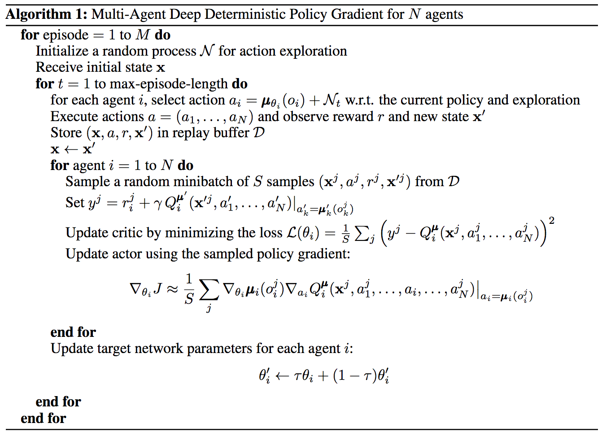
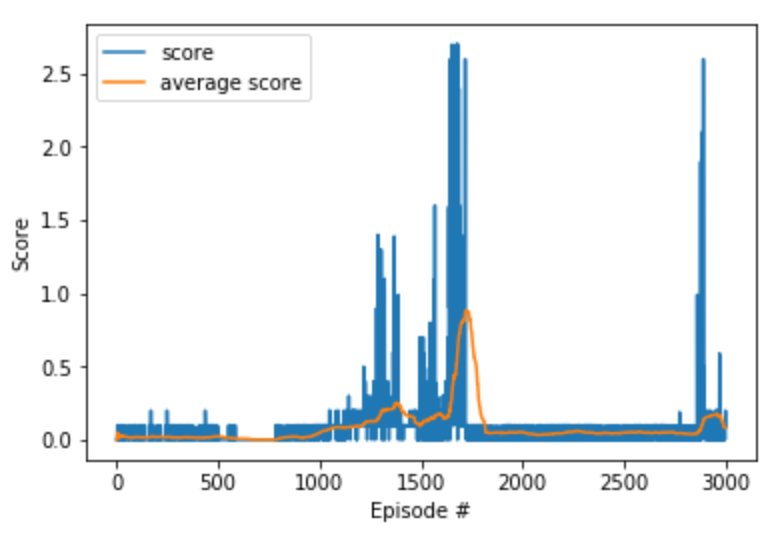

**Udacity's Deep Reinforcement Learning Nanodegree**

## Report on Collaboration and Competition project

### Short description on Multi-Agent Deep Deterministic Policy Gradient 

This project is to train two agents whose action space is continuous using an reinforcement learning method called Multi-Agent Deep Deterministic Policy Gradient (MADDPG).  MADDPG is a kind of "Actor-Critic" method. Unlike DDPG algorithm which trains each agent independantly, MADDPG trains actors and critics using all agents information (actions and states). However, the trained agent model (actor) can make an inference independentaly using its own state.

#### Model architecture

**1. Actor network**

The actor network is a multi-layer perceptron (MLP) with 2 hidden layers, which maps states to actions.

   * Input Layer —> 1st hidden layer (256 neurons, ReLu) —> Batch Normalization —> 2nd hidden layer (128 neurons, ReLu) —> Output layer (tanh)

```py
class Actor(nn.Module):
    """Actor (Policy) Model."""

    def __init__(self, state_size, action_size, seed=0, fc1_units=256, fc2_units=128):
        super(Actor, self).__init__()
        self.seed = torch.manual_seed(seed)
        self.fc1 = nn.Linear(state_size, fc1_units)
        self.fc2 = nn.Linear(fc1_units, fc2_units)
        self.fc3 = nn.Linear(fc2_units, action_size)
        self.bn1 = nn.BatchNorm1d(fc1_units)
        self.bn2 = nn.BatchNorm1d(fc2_units)
        self.reset_parameters()
        
    def forward(self, state):
        if state.dim() == 1:
            state = torch.unsqueeze(state,0)
        x = F.relu(self.fc1(state))
        x = self.bn1(x)
        x = F.relu(self.fc2(x))
        return torch.tanh(self.fc3(x))
        
```


**2. Critic network**

The critic network is also a multi-layer perceptron (MLP) with 2 hidden layers, which maps (state, action) pair to Q-value.


#### Training algorithm

1. The agents using the current policy and exploration noise interact with the environment, and the episodes are saved into the shared replay buffer.
2. For each agent, using a minibatch which is randomly selected from the reply buffer, the critic and the actor are trained using MADDPG training algorithm.
3. Target networks of actor and critic of agents are soft-updated respectively.




##### Additional resource on DDPG
- [Multi-Agent Actor-Critic for Mixed Cooperative-Competitive Environments](https://arxiv.org/abs/1706.02275)

### Train two agents

After different configuration on hyper-parameters and noise for action exploration, the below set solves the environment. Firstly, I used Ornstein-Uhlenbeck for noise, but I switched to random noise with standard normal distribution, which works for my case.

#### Hyper parameters

- Replay buffer size : 100000
- Minibatch size : 256
- Discount factor : 0.99
- Soft update of target parameter : 0.001
- Learning rate of the actor : 0.0001
- Learning rate of the critic : 0.0003

**Result**: The score is hardly increased in the early phase, and spikes after 1300th episode. After hitting the highest score above 2.7, it drops suddenly down to 0.1 or lower. Average score over 100 episodes reaches 0.513 at 1673th episode, which is considered to solve the environment.

   ```
0 episode	avg score 0.00000	max score 0.00000
500 episode	avg score 0.02460	max score 0.09000
1000 episode	avg score 0.04810	max score 0.10000
1500 episode	avg score 0.10680	max score 0.60000
1673 episode	avg score 0.51360	max score 2.70000
Environment solved after 1673 episodes with the average score 0.5136000077426434

2000 episode	avg score 0.05200	max score 0.00000
2500 episode	avg score 0.04790	max score 0.00000
2999 episode	avg score 0.08250	max score 0.09000
   ```

**Plot of reward**




### Ideas for Future work

Obviously fine tuning hyper-parameters is one of tasks to be done to stablize the policy to address the sudden drop of score after reaching the high score. For this, I'd like to trace changing parameters such as decayed noise to check if it is one of causes. Learning rate for actor and critic, and batch size are one to be tuned as well. Also, having different network architecture for actor and critic (deeper or wider) are something worth to be tried.


### Addtional Resource

* [Scaling Multi-Agent Reinforcement Learning](https://bair.berkeley.edu/blog/2018/12/12/rllib/)
* [Paper Collection of Multi-Agent Reinforcement Learning (MARL)](https://github.com/LantaoYu/MARL-Papers)

